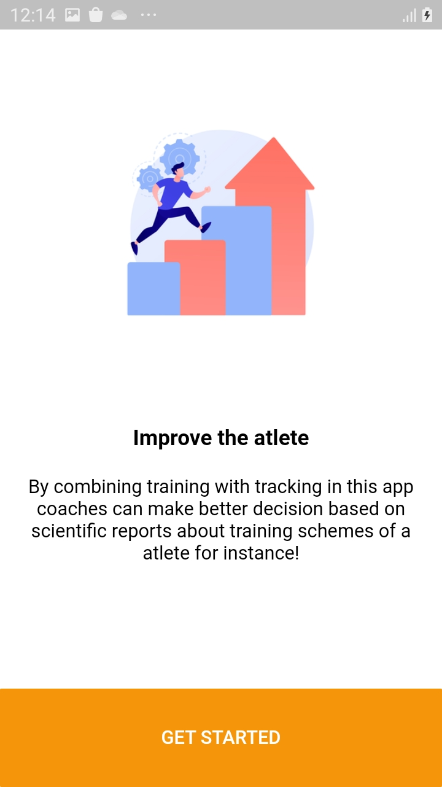
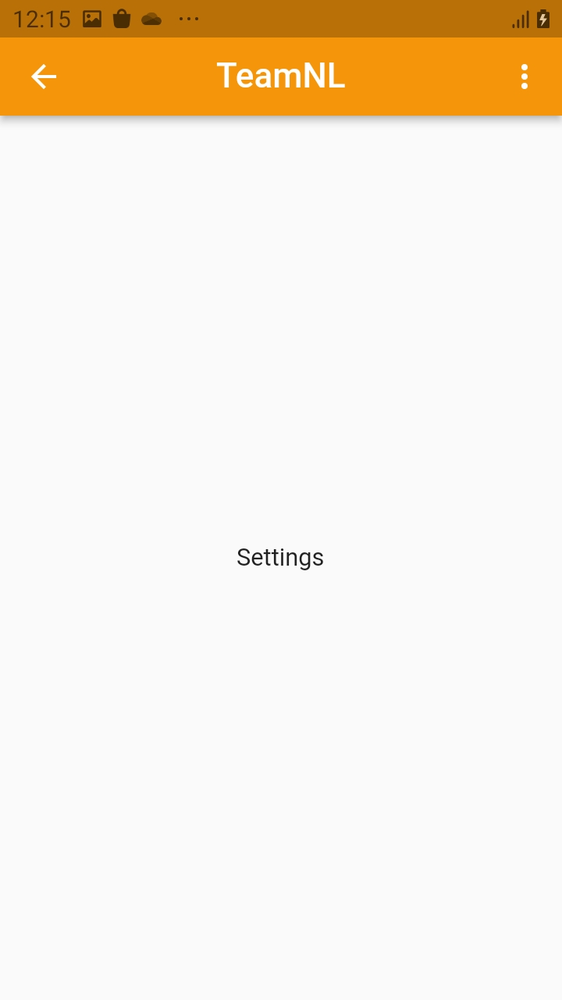
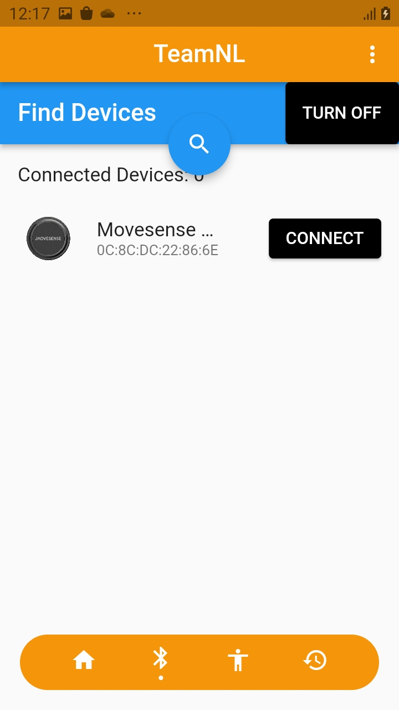
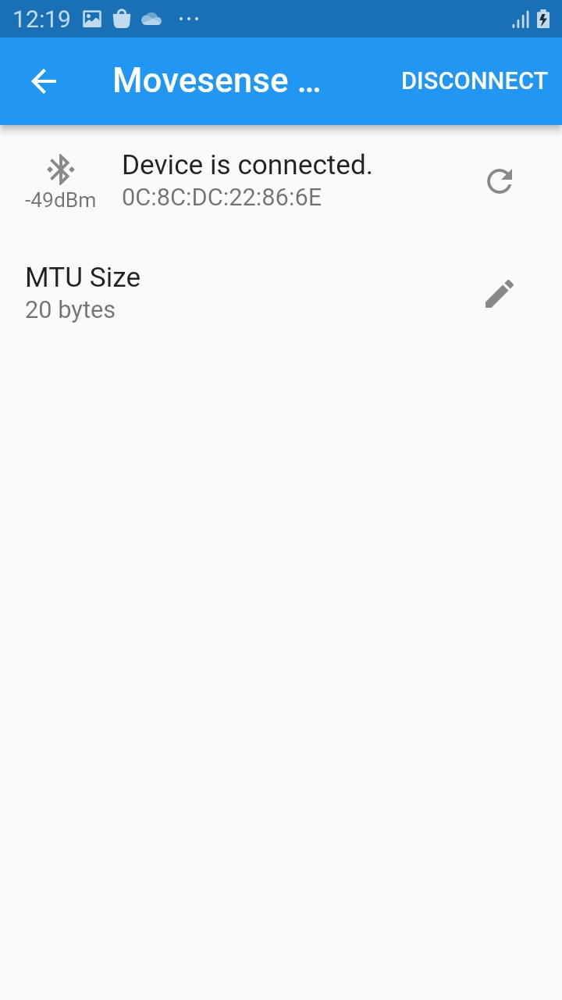

There are several features in the app.

|Name|Description|Image|
|-|-|-|
|Splash screen|A splash screen is a graphical user interface element that is typically used to provide visual feedback to the user while the app is loading. This can help to improve the user experience by giving the user something to look at while they are waiting for the app to become responsive. In some cases, a splash screen may also display branding or logo information for the app, or provide a brief overview of the app's features. Ultimately, the use of a splash screen is a matter of design preference, and it can be a useful tool for engaging the user and setting the tone for the app.||
|Onboarding screen|Onboarding screens are screens that are shown to users when they first start using a app. These screens are designed to introduce users to the app and explain its key features and functions. Onboarding screens often include step-by-step instructions or tutorials to help users get started with the app and become familiar with its interface and features. In short, an onboarding screen is a feature that helps new users understand and use a app.||
|Settings Bar|A settings bar is a user interface element that provides access to settings and preferences for an application. It is typically located at the top or bottom of the screen, and consists of a series of icons or buttons that allow users to adjust various settings. For example, a settings bar may include icons for notifications, turning on and off wireless connectivitys and more.||
|Bluetooth Low Energy|Bluetooth Low Energy, or BLE, is a wireless technology that is designed to provide low-power communication between devices. It is a variant of the Bluetooth standard, and is often used in devices such as fitness trackers, smartwatches, and other wearable technology, as well as in home automation and Internet of Things (IoT) devices. BLE is designed to consume less power than regular Bluetooth, which makes it well-suited for applications where the device needs to operate for long periods of time on a small battery like the movesense sensor that we have. With this feature you can turn bluetooth on, discover for bluetooth devices and connect with bluetooth devices.||
|Heartbeat charts|description|photo|
