# Mobile App
There are several features in the app.

|Name|Description|Image|
|-|-|-|
|Splash screen|A splash screen is a graphical user interface element that is typically used to provide visual feedback to the user while the app is loading. This can help to improve the user experience by giving the user something to look at while they are waiting for the app to become responsive. In some cases, a splash screen may also display branding or logo information for the app, or provide a brief overview of the app's features. Ultimately, the use of a splash screen is a matter of design preference, and it can be a useful tool for engaging the user and setting the tone for the app.|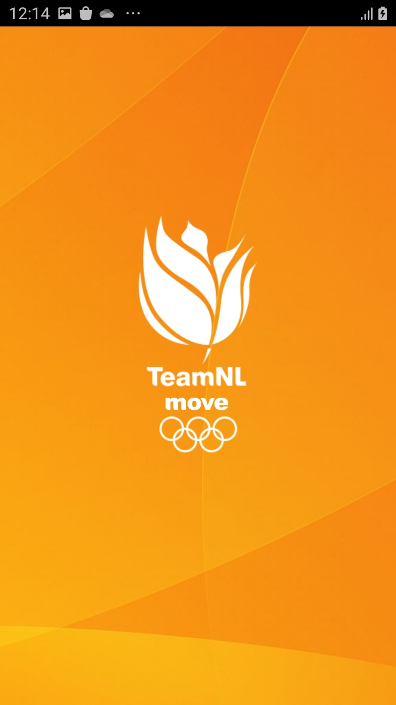|
|Onboarding screen|Onboarding screens are screens that are shown to users when they first start using a app. These screens are designed to introduce users to the app and explain its key features and functions. Onboarding screens often include step-by-step instructions or tutorials to help users get started with the app and become familiar with its interface and features. In short, an onboarding screen is a feature that helps new users understand and use a app.|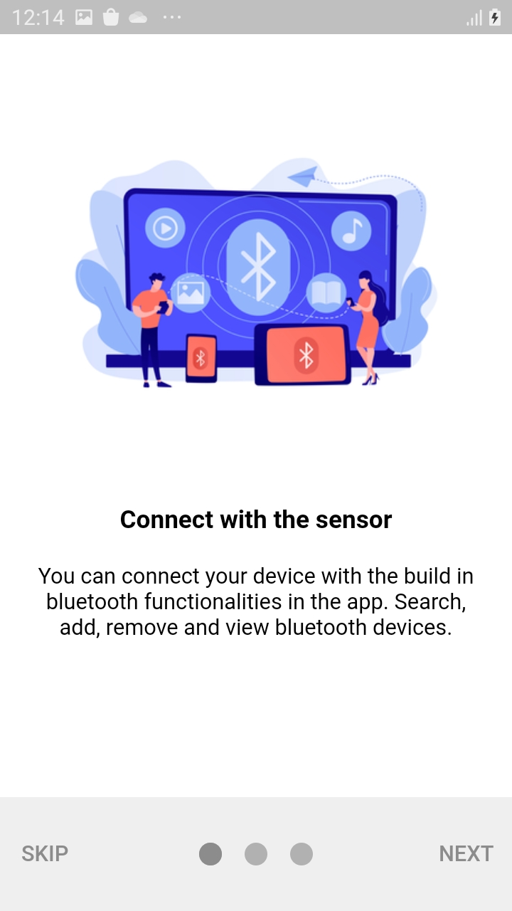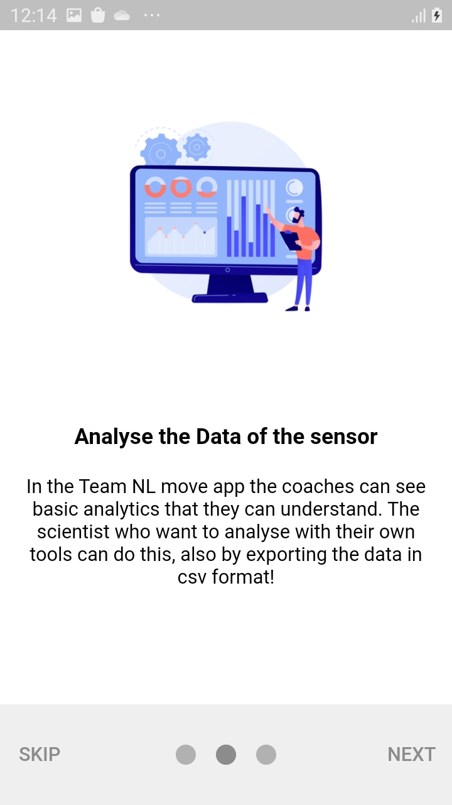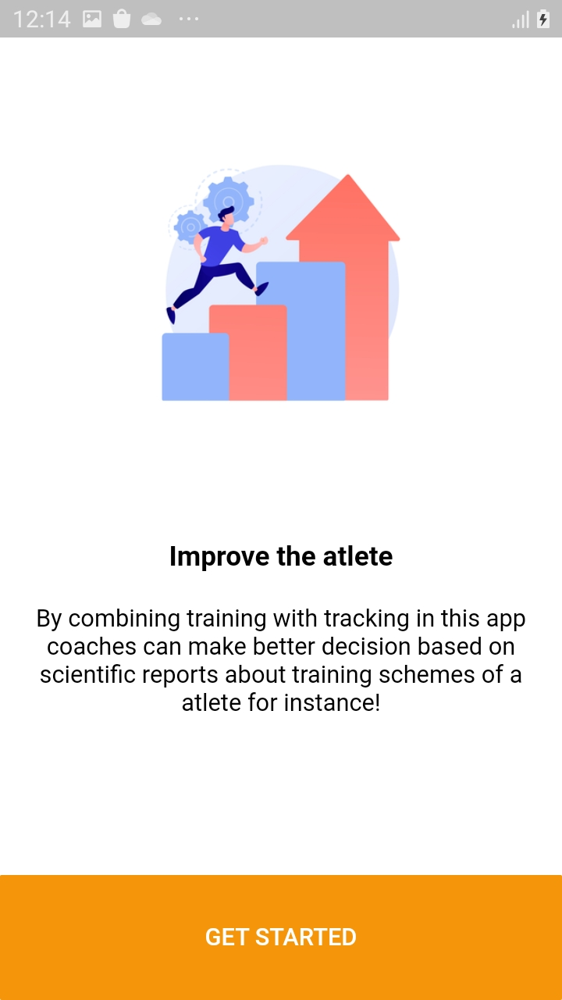|
|Register and Login|Create an account by registering or login using an existing account|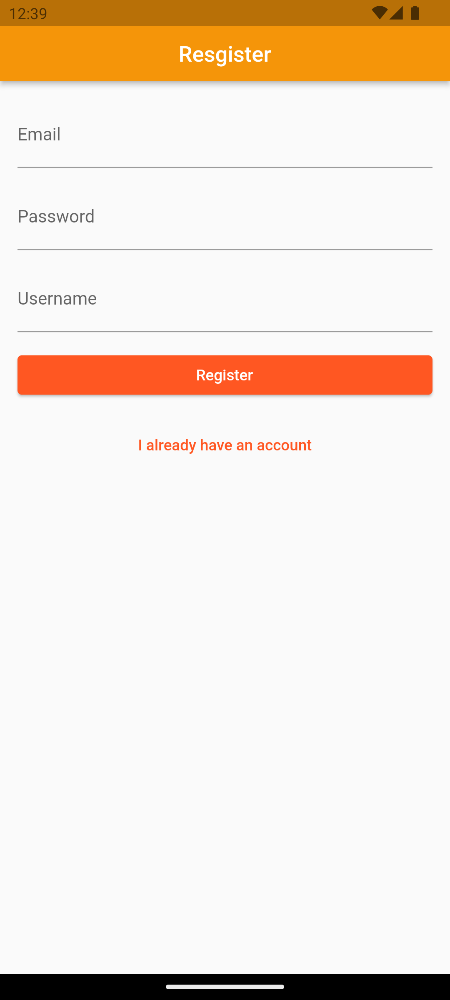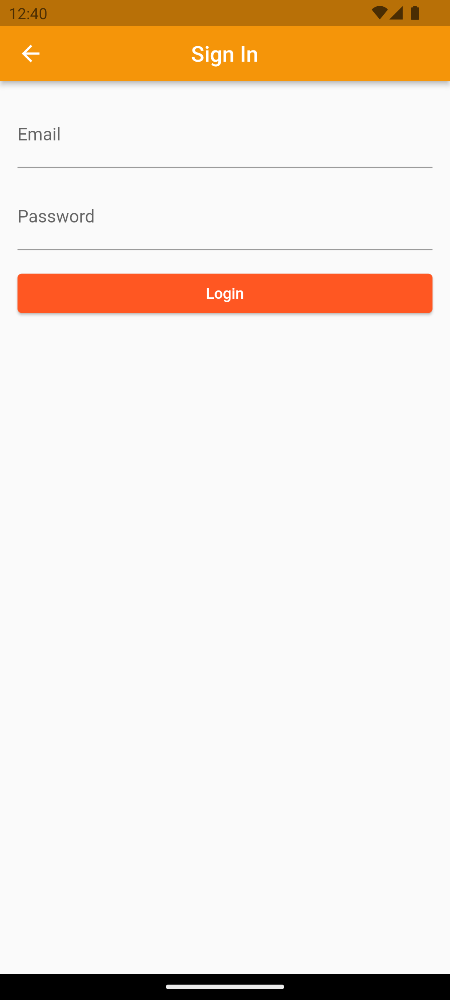|
|Settings Bar|A settings bar is a user interface element that provides access to settings and preferences for an application. It is typically located at the top or bottom of the screen, and consists of a series of icons or buttons that allow users to adjust various settings. For example, a settings bar may include icons for notifications, turning on and off wireless connectivitys and more. Users can also logout from this page.|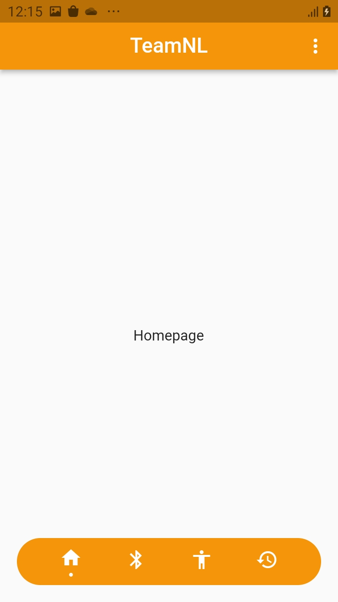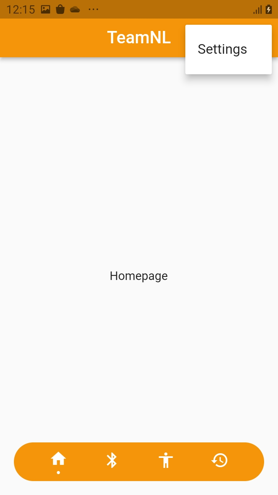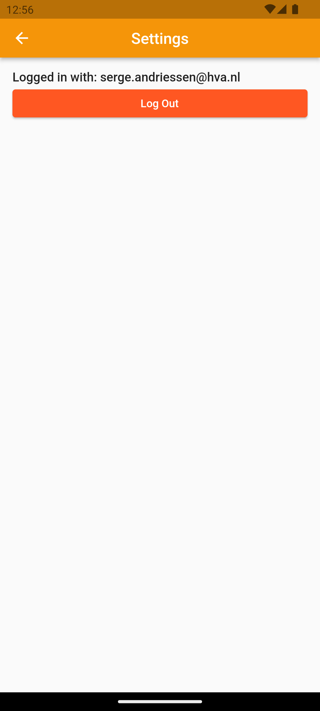|
|Bluetooth Low Energy|Bluetooth Low Energy, or BLE, is a wireless technology that is designed to provide low-power communication between devices. It is a variant of the Bluetooth standard, and is often used in devices such as fitness trackers, smartwatches, and other wearable technology, as well as in home automation and Internet of Things (IoT) devices. BLE is designed to consume less power than regular Bluetooth, which makes it well-suited for applications where the device needs to operate for long periods of time on a small battery like the movesense sensor that we have. With this feature you can turn bluetooth on, discover for bluetooth devices and connect with bluetooth devices.|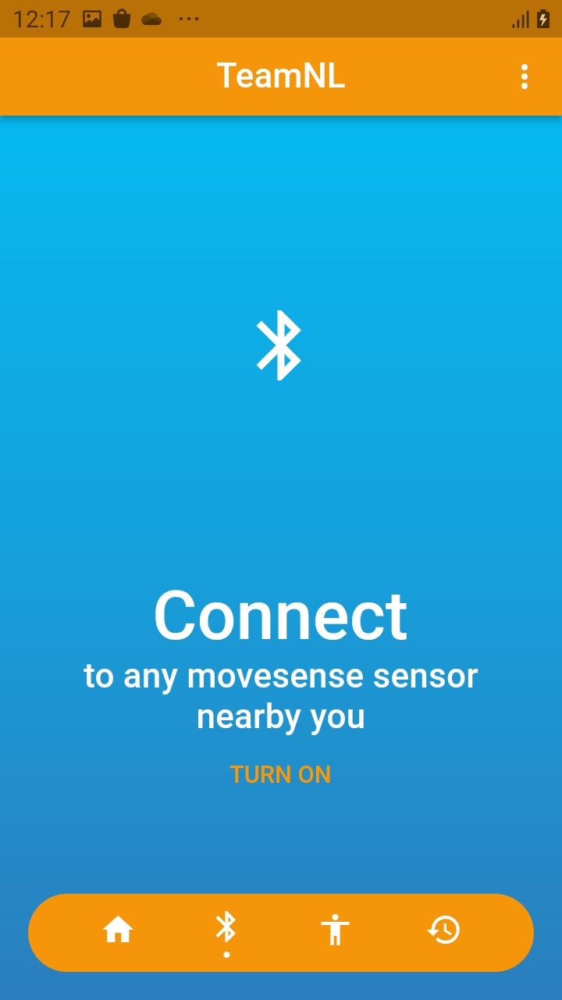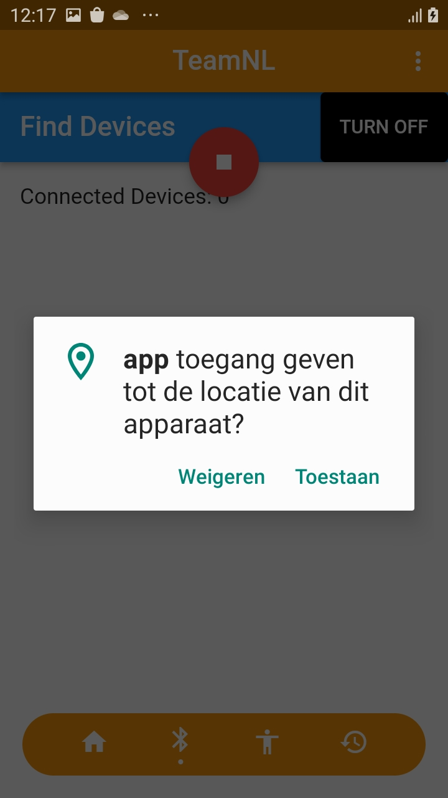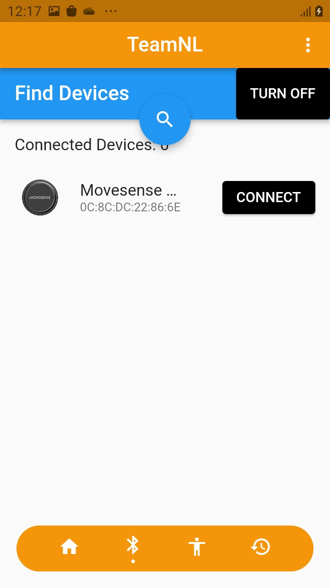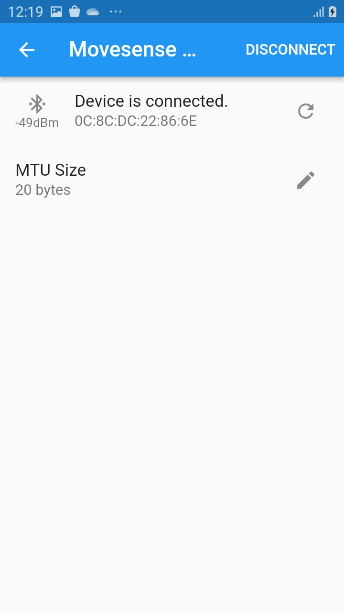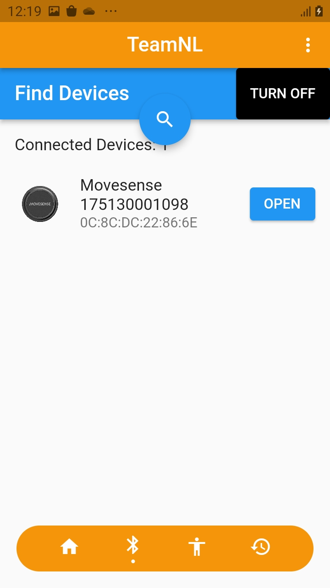|
|Start session|On the current page, the user can visualize the loaded script. The user gets an overview of all the scripts with a corresponding description. On the right side of the screen are the selection buttons. These allow the user to select which scripts are to be visualized. At the top right is a button that redirects the user to the sensor page. Here the user can select which sensor to use. At least one script must be selected to start the session. If no script is selected then the button remains grayed out. If a script is selected then the button turns orange and the user can start the session.  The user is then redirected to the heart rate page, where the data can be read in the graphs.|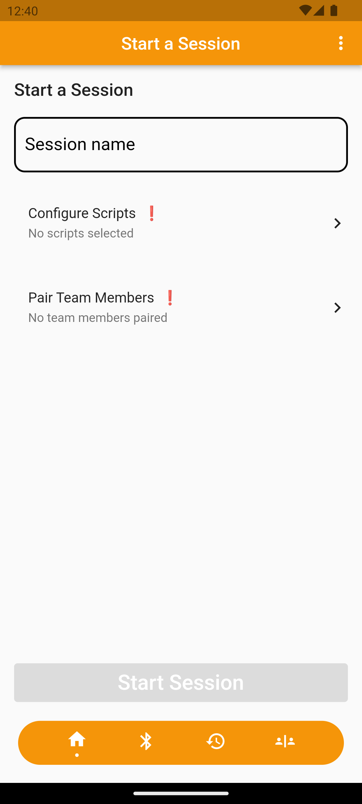|
|Select Scripts|Before starting a sessions one or more scripts must be selected to be used for the session, this can be done on the select scripts page. Users can select scripts and search for scripts. Scripts select by a user are saved as a preference.|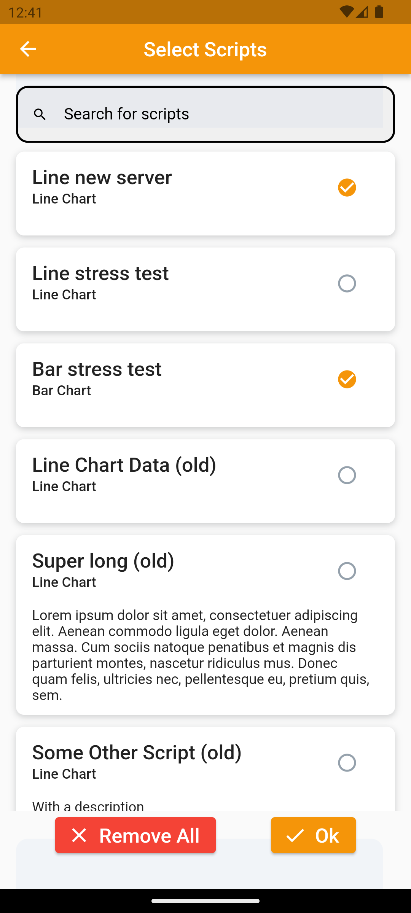|
|Pair sensors|Users can associate sensors with team members before starting a session. The user can choose at the top which team he or she wants selected. Teams are only visible if they have been created in the team settings page. Once the user has selected a team, then the user can choose which player and should be linked to the sensor. Also the players are only visible if they are created in the team settings page. The user will see "Pair sensor" to the right of the player. If the user clicks this, then the sensor is paired with the player.|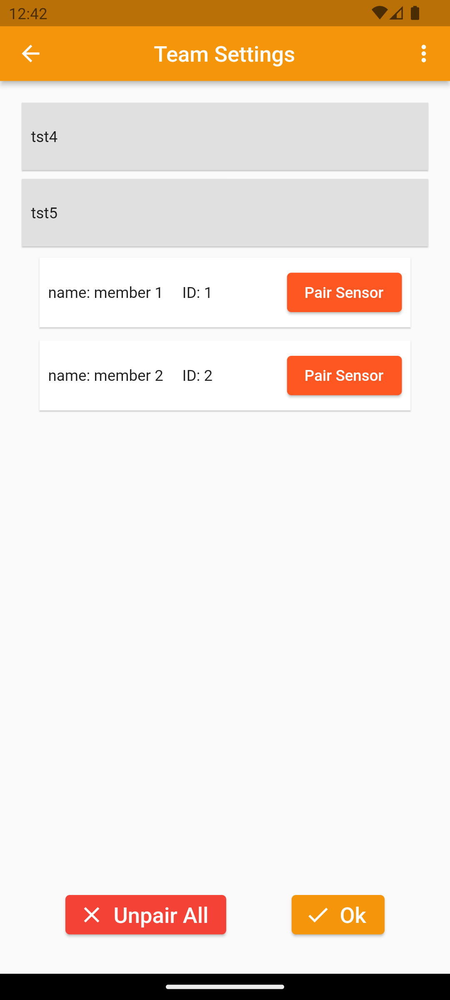|
|Heartbeat charts|By clicking on the start session button the user can start a session and see the chats created for the session. A heart rate chart is a graph that shows the heart rate over a period of time. It is often used to monitor the heart rate of a person and detect any abnormalities. The heart rate is measured in beats per minute and can be determined by counting the number of times the heart beats in one minute. The data used in the charts is retrieved from the server.|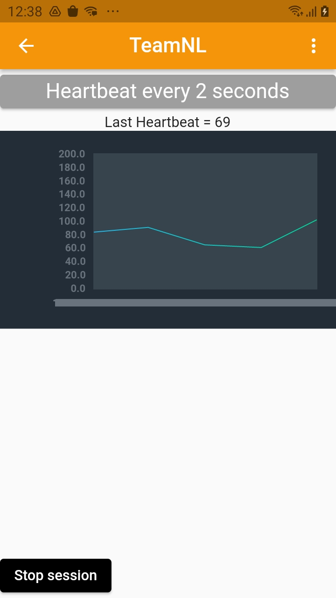|
|Team Settings|In the teams settings page, coaches can create teams and add player to their teams. Teams and players can also be removed. ||
|Session History|When the user clicks on the history icon in search, the user is redirected to the history page. This page lists all the scripts. The scripts have a name, a start and end date and time. This allows the user to see when the session started and when the session stopped. In the search bar the user can search for the desired scripts.|
