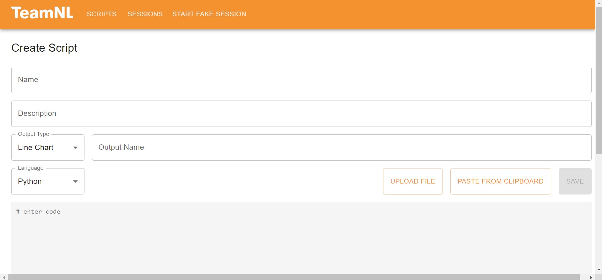

# Web Application
Website: **<a target="_blank" href="http://teamnl-t-iot-vm.westeurope.cloudapp.azure.com/">team-nl-iot-2022.onrender.com</a>**

## Scripts
Link: **<a target="_blank" href="http://teamnl-t-iot-vm.westeurope.cloudapp.azure.com/scripts">team-nl-iot-2022.onrender.com/scripts</a>**  

This is the scripts site, where scripts can be created, uploaded or deleted. The scripts that are saved can be seen in a summary list on the site. 

## Create or upload a script
Link: **<a target="_blank" href="http://teamnl-t-iot-vm.westeurope.cloudapp.azure.com/scripts/create">team-nl-iot-2022.onrender.com/scripts/create</a>**  

When creating or uploading a script, a name must be associated with the file. A description can be given, if needed. On the left side you can choose what kind of graph you want the data in. So far, the data scientist can choose to process the data in a line or bar graph. At output name, the data scientist gives a name to the graph. This is then displayed in the app. The script can be written in two different ways. It can be in the Python programming language or in R. Once everything is completed, the user can upload the script so that the data can be processed.

