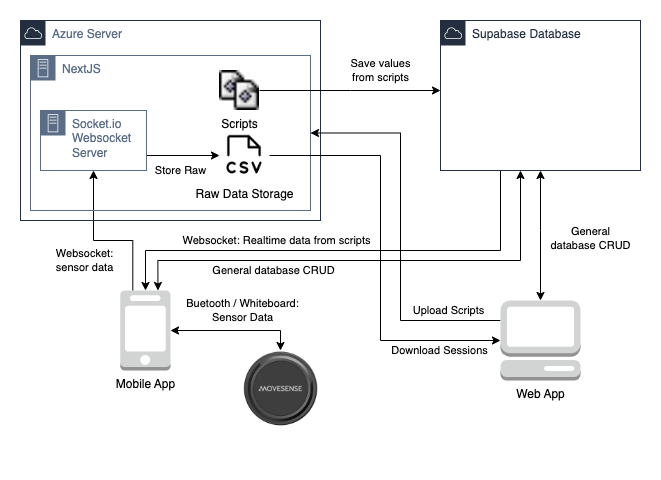

# Technical Overview

The core idea behind the app is to gather data from sensors and then to have scripts perform data analysis on the sensor data. 

Data is retrieved from connected Movesens sensors usings Movenens proprietary Whiteboard protocol. 

We chose to run the scripts on the back-end instead of locally in the app because of 2 reasons:

1. Security, downloading user created scripts and running them on a users device would have major security riscs.
2. Embeded scientists from TeamNL required that scripts can be written in languages they know (Python of R), running these languages on mobile devices would be hard to get working.

When a session is started, the sensor data is send to the back-end over a websocket connection using a websocket server running on the back-end. The request to start a session specifieds which scripts should be ran, these scripts are started on the back-end and receive the incoming sensor data. Saved values from scripts are stored as records in the database. 
Incoming sensor data on the back-end is also saved to a CSV file. 
For more details about the websocket connection and handeling scripts read the [Web Application Documentation](/web-application/code-documentation/). 

At the start of a session, the mobile app starts a subscription to the database for real time updates from the results of the selected scripts using Supabase Realtime. 
For more information about Supabase read the [Database Documentation](/database/)