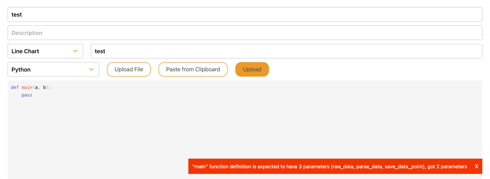

# Code Documentation

## Uploading Scripts
Scripts uploaded to the web application are saved to disk so that they can be used when sessions are started in the future and have their meta data save to the database. But before doing so a validator checks the script to make sure that the script is valid. It checks if the 'main' function is present and if it uses the correct amount of paramaters. If the validator detects a problem a message is send to the web application informing the user what's wrong with the uploaded script.

In this case the 'main' function is messing it's third parameter.

## Handeling Sessions
When sessions are started in the app, they connect to a websocket on the server. Every bit of data coming of the sensors is directly send to the webserver over this websocket. Websockets are use because they create a continuous connection between the app and the server, reducing the overhead per send message and therefor allowing for a high number of messages to be send back and forth. This is very important because the sensors will be sending data up to hundreds of times per second. 

## Handeling Scripts
New sessions, started by connecting to the websocket, specify which scripts to run for that session. For each of these scripts a process is started that will run the script. Information is send back and forth between the server process and the script processes using `stdin` and `stdout`, this allows the server to communicate with scripts written in different languages. Each process is started with a script handler, this script handler serves a couple of purposes. It starts the specified script, it listens to the `stdin` where serialized sensor data comes in and provides the parsed data to the script and it provides a funtion to the script to save a value wich it serializes and sends to the `stdout`.

## Storing Raw Sensor Daat
CSV files are created for each session member when a session is started. Whenever session data is received for a session member, the raw sensor data is appended to its CSV file.